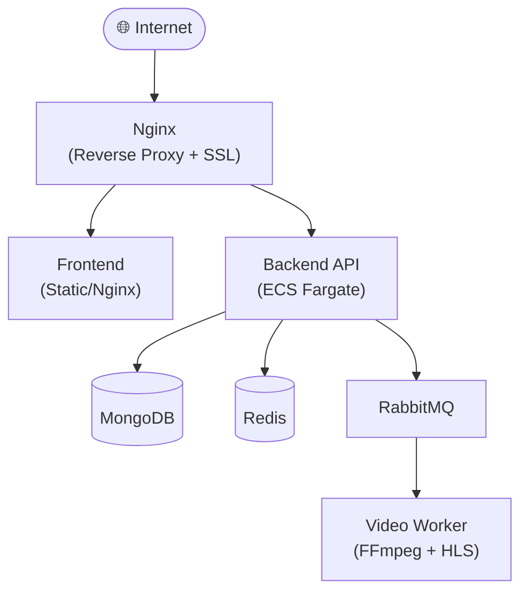

<p align="center">
  
</p>

<h1 align="center">🎮 ArenaHub - AOV Social Platform</h1>

<p align="center">
  <strong>Nền tảng mạng xã hội dành cho cộng đồng chơi game Arena of Valor (Liên Quân Mobile)</strong>
</p>

<p align="center">
  <a href="#features">Features</a> •
  <a href="#tech-stack">Tech Stack</a> •
  <a href="#quick-start">Quick Start</a> •
  <a href="#development">Development</a> •
  <a href="#deployment">Deployment</a> •
  <a href="#cicd">CI/CD</a> •
  <a href="#contributors">Contributors</a>
</p>

---

## 📋 Giới thiệu

**ArenaHub** là nền tảng mạng xã hội toàn diện được xây dựng dành riêng cho cộng đồng game thủ Liên Quân Mobile (Arena of Valor). Nền tảng cho phép người chơi kết nối, chia sẻ, tìm đồng đội và nhận tư vấn từ AI Coach.

---

## ✨ Features

### 🔐 Xác thực & Hồ sơ người dùng
- Đăng ký với xác minh hồ sơ game tự động qua **Gemini Vision AI**
- Trích xuất thông tin: Level, Rank, Win Rate, Tổng trận, Điểm tín nhiệm
- JWT Authentication & Password Recovery qua email

### 📱 Mạng xã hội
- **Feed bài viết** với ảnh và video
- **Thả tim, bình luận, chia sẻ** bài viết
- **Reels** - Video ngắn với HLS streaming
- **Hệ thống bạn bè** với gợi ý thông minh

### 💬 Tin nhắn Real-time
- Chat 1-1 và chat nhóm
- Gửi ảnh, video trong tin nhắn
- Trạng thái online và typing indicator

### 🎮 Tìm đội (LFG - Looking for Group)
- Tạo phòng chơi theo rank và chế độ game
- Gửi yêu cầu tham gia với tin nhắn
- Tự động tạo group chat cho team

### 📰 Diễn đàn Forum
- Tạo chủ đề thảo luận theo danh mục
- Like, comment trong forum
- Hệ thống báo cáo nội dung vi phạm

### 🤖 AI Coach Chatbot
- Tư vấn tướng và cách chơi
- Sử dụng **RAG (Retrieval-Augmented Generation)**
- Lưu trữ lịch sử hội thoại

### 🔔 Thông báo Real-time
- Thông báo tương tác (like, comment, share)
- Thông báo tìm đội và kết bạn
- Thông báo xử lý report từ Admin

### 👨‍💼 Admin Dashboard
- Quản lý người dùng và phân quyền
- Kiểm duyệt báo cáo nội dung
- Thống kê hệ thống với biểu đồ trực quan

---

## 🛠 Tech Stack

### Backend
| Công nghệ | Mô tả |
|-----------|-------|
|  | Python Web Framework |
|  | NoSQL Database |
|  | Cache & Pub/Sub |
|  | Message Queue |
|  | MongoDB ODM |

### Frontend
| Công nghệ | Mô tả |
|-----------|-------|
|  | UI Library |
|  | Type Safety |
|  | Build Tool |
|  | Data Visualization |

### Infrastructure
| Công nghệ | Mô tả |
|-----------|-------|
|  | Containerization |
|  | Container Orchestration |
|  | Reverse Proxy |
|  | Object Storage |

### AI/ML
| Công nghệ | Mô tả |
|-----------|-------|
|  | Vision API & LLM |

---

## 🚀 Quick Start

### Prerequisites
- Docker & Docker Compose
- Node.js 18+
- Python 3.11+
- MongoDB, Redis, RabbitMQ (hoặc dùng Docker)

### 1. Clone repository

```bash
git clone https://github.com/huyt39/AOV-Social-Platform.git
cd AOV-Social-Platform
```

### 2. Cấu hình environment

```bash
cp .env.example .env
# Chỉnh sửa file .env với các thông tin cần thiết
```

### 3. Khởi động Docker services

```bash
docker compose up -d video-worker rabbitmq redis mongodb
```

### 4. Chạy Backend

```bash
cd backend
uv sync                           # Cài đặt dependencies
source .venv/bin/activate         # Kích hoạt virtual environment
uvicorn app.main:app --host 0.0.0.0 --port 8000 --reload
```

### 5. Chạy Frontend (terminal mới)

```bash
cd frontend
npm install                       # Cài đặt dependencies
npm run dev                       # Chạy development server
```

### 6. Truy cập ứng dụng

| Service | URL |
|---------|-----|
| Frontend | http://localhost:3000 |
| Backend API | http://localhost:8000 |
| API Docs (Swagger) | http://localhost:8000/docs |
| RabbitMQ Management | http://localhost:15672 |

---

## 💻 Development

### Cấu trúc thư mục

```
AOV-Social-Platform/
├── backend/                 # FastAPI Backend
│   ├── app/
│   │   ├── api/            # API Routes
│   │   ├── models/         # Pydantic/Beanie Models
│   │   ├── services/       # Business Logic
│   │   ├── llm/            # AI/LLM Integration
│   │   └── core/           # Configuration
│   └── requirements.txt
├── frontend/               # React Frontend
│   ├── components/         # React Components
│   ├── contexts/           # React Contexts
│   ├── types/              # TypeScript Types
│   └── package.json
├── video-worker/           # Video Processing Worker
├── docker-compose.yml      # Docker Compose config
└── .github/workflows/      # CI/CD Pipelines
```

### Pre-commit Hooks

Dự án sử dụng pre-commit để đảm bảo code quality:

```bash
# Cài đặt pre-commit
uv run pre-commit install

# Chạy thủ công
uv run pre-commit run --all-files
```

### Code Linting

- **Backend**: Ruff (linting + formatting)
- **Frontend**: ESLint + Prettier

---

## 🌐 Deployment

### Kiến trúc Production



### Deploy với Docker Compose

```bash
# Production deployment
docker compose -f docker-compose.yml up -d
```

### Environment Variables

| Variable | Mô tả |
|----------|-------|
| `SECRET_KEY` | JWT Secret Key |
| `MONGODB_URL` | MongoDB connection string |
| `REDIS_URL` | Redis connection string |
| `RABBITMQ_URL` | RabbitMQ connection string |
| `S3_ACCESS_KEY` | S3 Access Key |
| `S3_SECRET_KEY` | S3 Secret Key |
| `GEMINI_API_KEY` | Google Gemini API Key |
| `IMGBB_API_KEY` | ImgBB API Key (cho upload ảnh) |

---

## 🔄 CI/CD

### GitHub Actions Pipeline

Dự án sử dụng GitHub Actions để tự động hóa quy trình CI/CD:

```yaml
Workflow: Deploy to Amazon ECS
├── Trigger: Push to main branch
├── Steps:
│   ├── 1. Checkout code
│   ├── 2. Login to Docker Hub
│   ├── 3. Configure AWS credentials
│   ├── 4. Build & Push Backend Docker image
│   ├── 5. Update ECS Task Definition
│   ├── 6. Deploy to ECS Fargate
│   └── 7. Update Nginx with new Backend IP
```

### Required Secrets (GitHub)

| Secret | Mô tả |
|--------|-------|
| `DOCKERHUB_USERNAME` | Docker Hub username |
| `DOCKERHUB_TOKEN` | Docker Hub access token |
| `AWS_ACCESS_KEY_ID` | AWS Access Key |
| `AWS_SECRET_ACCESS_KEY` | AWS Secret Key |
| `NGINX_EC2_HOST` | EC2 Instance public IP |
| `NGINX_EC2_SSH_KEY` | SSH private key cho EC2 |

### Deployment Flow

```mermaid
flowchart LR
    A["Developer Push"] --> B["GitHub Actions"]
    B --> C["Docker Build"]
    C --> D["Push to Docker Hub"]
    D --> E["ECS Task Definition Update"]
    E --> F["Deploy to ECS Fargate"]
    F --> G["Get Backend Private IP"]
    G --> H["Update Nginx Configuration"]
    H --> I["✅ Production Live"]
```



---

## 👥 Contributors

<table>
  <tr>
    <td align="center">
      <a href="https://github.com/linhgrr">
        
        <br />
        <sub><b>linhgrr</b></sub>
      </a>
    </td>
    <td align="center">
      <a href="https://github.com/cuonggpham">
        
        <br />
        <sub><b>cuonggpham</b></sub>
      </a>
    </td>
    <td align="center">
      <a href="https://github.com/huyt39">
        
        <br />
        <sub><b>huyt39</b></sub>
      </a>
    </td>
    <td align="center">
      <a href="https://github.com/ktoan911">
        
        <br />
        <sub><b>ktoan911</b></sub>
      </a>
    </td>
  </tr>
</table>

---

## 📄 License

This project is licensed under the MIT License - see the [LICENSE](LICENSE) file for details.

---

## 🙏 Acknowledgments

- [FastAPI](https://fastapi.tiangolo.com/) - Modern Python web framework
- [React](https://react.dev/) - UI Library
- [MongoDB](https://www.mongodb.com/) - NoSQL Database
- [Google Gemini](https://ai.google.dev/) - AI Vision & LLM

---

<p align="center">
  Made with ❤️ by Liqi88 Team 
</p>
